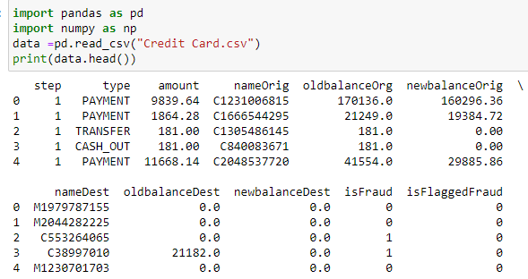

# Online-Payments-Fraud-Detection-with-Machine-Learning

The introduction of online payment systems has made payments easier. But at the same time payment methods have also increased. Anyone who uses payment systems is a potential online payment scam especially if you use a credit card pay. This is why detecting onlone payment fraud is so important for credit companies. This ensures that customers are not billed for products or services they nerver pay for. if you want to know how to detect online payments fraud this article will help you. This article describes the task of detecting online payment fraud using machine learning python.

Identifing online payment fraud through machine learning model to classify fraudulent and non fraudulent payments. To do we need a dataset containing information on online payment fraud to understand the types of transactions that lead to fraud. For this work I collected a <a href="https://www.kaggle.com/ealaxi/paysim1/download">dataset</a> from Kaggle contaning historical information about fraudulent transactions for detecting online payment fraud.
<h2>Here are all the columns in the dataset Im using here:</h2>

<b><li>step: represents a unit of time where 1 step equals 1 hour</li>
<li>type: type of online transaction</li>
<li>amount: the amount of the transaction</li>
<li>nameOrig: customer starting the transaction</li>
<li>oldbalanceOrg: balance before the transaction</li>
<li>newbalanceOrig: balance after the transaction</li>
<li>nameDest: recipient of the transaction</li>
<li>oldbalanceDest: initial balance of recipient before the transaction</li>
<li>newbalanceDest: the new balance of recipient after the transaction</li>
<li>isFraud: fraud transaction</li></b>

<h2>I start this task by importing the Python libraries and datasets required for this task:<h2>
<
